***<h1 align = "center">Pasteuriser AI Assistant</a>***

# Содержание

1) [Прогнозирование временных рядов с помощью LSTM](#прогнозирование-временных-рядов-с-помощью-lstm)
    - [Поиск и выбор средств прогнозирования](#поиск-и-выбор-средств-прогнозирования)
    - [Математическая модель LSTM](#математическая-модель-lstm)
    - [Метод обратного распространения во времени:](#метод-обратного-распространения-во-времени)
2) [Решение возникших при разработке проблем и решения по коду](#решение-возникших-при-разработке-проблем-и-решения-по-коду)
    - [Контейнер для хранения данных](#контейнер-для-хранения-данных)
    - [Парсинг данных](#парсинг-данных)
    - [Выравнивание диапазонов цепочки данных](#выравнивание-диапазонов-цепочки-данных)
    - [Скейлинг данных](#скейлинг-данных)
3) [Результаты работы программы](#результаты-работы-программы)

# Прогнозирование временных рядов с помощью LSTM

## Поиск и выбор средств прогнозирования

В ходе изучения задачи прогнозирования и дальнейшего поиска её решения были рассмотрены такие средства прогнозирования как ARMA, ARIMA, деревья решений, множественная регрессия. Однако было принято решение остановиться на нейросетевом способе, а именно на рекуррентных нейронных сетях. В качестве модели прогнозирования была выбрана модель LSTM. Был изучен её математический аппарат, а также метод обратного распространения во времени для обучения LSTM.

## Математическая модель LSTM

Предсказание LSTM основывается на предыдущих результатах предсказания. Поэтому LSTM для предсказания можно отобразить следующим образом: 

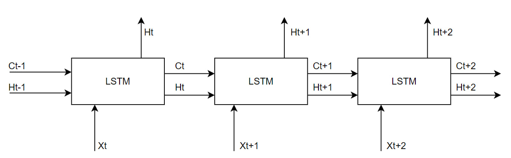  

На картинке представлена LSTM относительно её блоков. На вход она принимает некоторые значения Xt и свою память Ht-1 и Ct-1 и выдаёт Ht для дальнейшего расчёта предсказания. Ниже на картинке будет представлена нейронная схема одного блока LSTM:

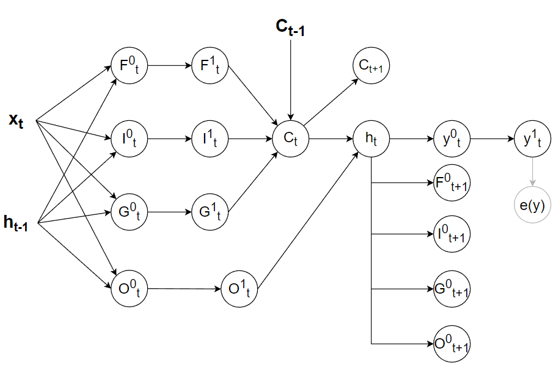  

В качестве входных данных выступают xt, ht-1 и Ct-1. Что есть что? xt - вектор входных значений, представляющий цепочку реальных данных. ht-1 - вектор передающийся из прошлой итерации сети, представляющий краткосрочную память сети. ht-1 - вектор передающийся из прошлой итерации сети, представляющий долгосрочную память сети. Сеть, имея долгосрочную и краткосрочную память, поэтому и называется Long short-term memory.

Теперь разберём элементы, которые находятся в самом блоке LSTM. Ft - это один из так называемых вентилей и врат сети, представляющий вектор забывания. Его смысл в том, что он указывает на то, что необходимо как бы забыть из долгосрочной памяти.

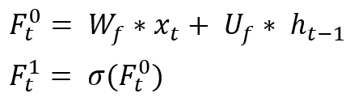  

It и Gt - это вентили сети, представляющий вектор новых состояний долгосрочной памяти. Смысл Gt заключается в том, что он сосдаёт новых претиндентов на место новой долгосрочной памяти, а It уже будет решать, что из Gt попадёт в настоящую долгосрочную память.

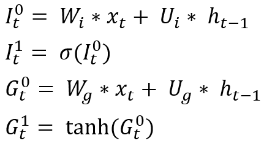  

Ot - это вентиль сети, представляющий вектор выходных значений долгосрочной памяти для расчёта новой краткосрочной памяти. Смысл Ot заключается в том, что он говорит, какая часть из долгосрочной памяти нам необходима, чтобы выполнить предсказание на основе расчёта краткосрочной памяти. 

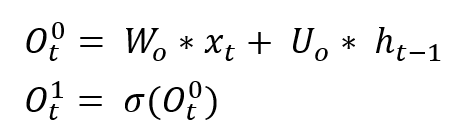  

Далее рассчитываем долгосрочную Ct и краткосрочную память ht.

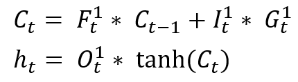  

После чего приступаем к расчёту прогноза.

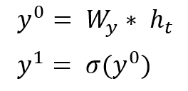  

## Метод обратного распространения во времени  

Сеть обучается по методу обратного распространения во времени. Пояснения по формулам давать незачем, поэтому только выведим их, т.к. их цель найти распространения ошибки по весам для их изменения по backpropagation.

Рассчитаем ошибку по предсказанию и обучим веса предсказания: 

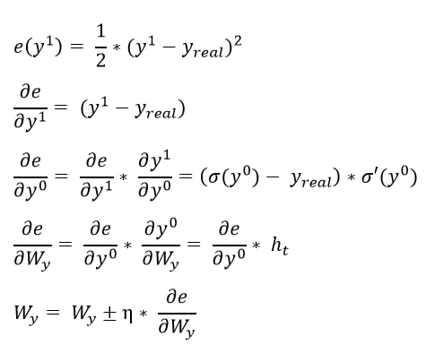  

Рассчитаем ошибку по памяти сети: 

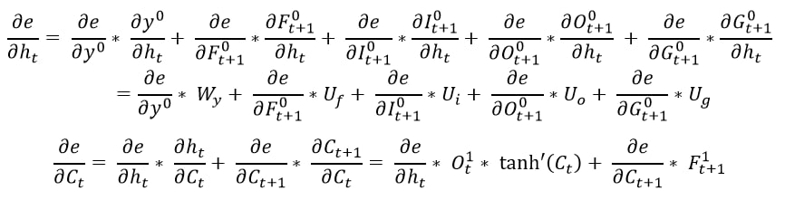  

Рассчитаем ошибку по выходным вратам и обучим выходным веса: 

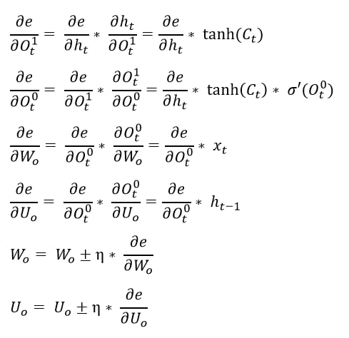  

Рассчитаем ошибку по входным вратам и обучим входные веса: 

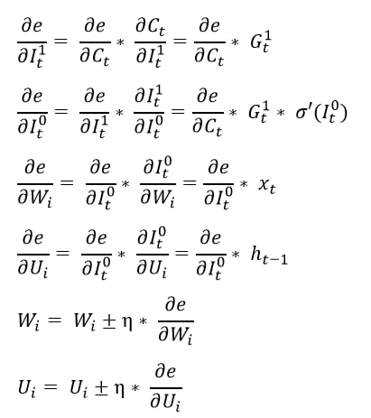  

Рассчитаем ошибку по вратам состояний и обучим веса состояний: 

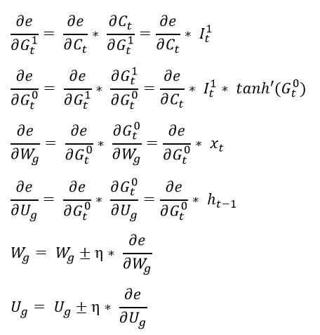  

Рассчитаем ошибку по вратам забывания и обучим веса забывания: 

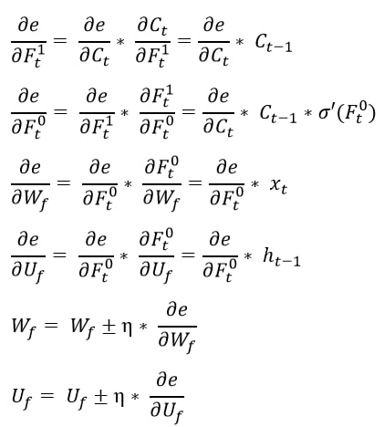  

# Решение возникших при разработке проблем и решения по коду

## Контейнер для хранения данных

В ходе разработки программы возникли проблемы с чтением данных из файла. Они заключались в слишком долгом считывании данных при использовании стандартных STL библиотек vector и list, а также в дальнейшем обращении к элементам. 

Конечно, list является более предпочтительным для сокращения времени считывания данных, однако в дальнейшем бы возникала проблема обращения к данным, которые находятся ближе к середине, а в ходе выполнения программы обращение к данным происходит очень часто. Поэтому использовать list для сокращения времени считывания данных влечёт проблемы с потерей времени при дальнейшем обращении к элементам списка. К тому же STL list является двунаправленным списком, а значит для каждого контейнера листа имеется указатели на предыдущий и на следующий элемент, что при наличии более миллиона элементов в списке влечёт проблему с большой занимаемой памятью. Для уменьшения памяти можно было бы использовать STL forward list, однако возникла бы большая проблема с обращением к данным.

Если STL list не подходит, тогда взглянем на STL vector. Vector позволяет хранить данные, занимая меньше памяти, чем list. Также vector позволяет эффективно и быстро обращаться к своим элементам, что также является плюсом относительно list. Однако vector уступает list по скорости считывания данных из файла. 

При решении этой проблемы, необходима была динамическая структура, которая бы считывала данные из файла не медленнее чем STL list, а также сохраняла все достоинства STL vector. Для этого была создана структура DATA, которая описывала данные строки из файла. Т.е. содержала в себе переменные для сида, момента времени и значения датчика. Также в структуре перегружены операторы ввода и вывода для удобной записи и вывода полей структуры. Также была создана динамическая структура DataVector, которая представляет собой переделанные под наши задачи и цели STL vector. Были разработаны методы, которые сразу выделяют память под количество строк в файле с данными и тем самым быстро обеспечивается считывание данных, при этом сохраняя достоинства STL vector. Однако, также была изменена формула для выделения дополнительной памяти capacity, чтобы DataVector занимал меньше памяти.  

DataVector и DATA соединены композицией. Описание DATA и DataVector находится в файлах data_form.h и data_form.cpp.

## Парсинг данных

Следующая проблема, после считывания данных, это их парсинг. Поскольку в исходных файлах с данными находятся данные, снятые с разных датчиков, то появилась необходимость разделить эти самые данные по датчикам. Поэтому была разработана функция парсина по сиду, поскольку сид относится к конкретному датчику. Функция описана в data_reform.h и data_reform.cpp.

## Выравнивание диапазонов цепочки данных

В ходе изучения различных моделей для прогнозирования было обнаружено, что многие модели предполагают равное удаление точек по оси Х. У нас же данные по этой оси не равно удалены, а должны быть, поскольку LSTM  предполагает это самое равное удаление точек по оси Х. Поэтому была разработана функция, которая "выравнивает" диапазоны между точками по оси Х. Она ищет две точки из настоящей цепочки и заменяет этот промежуток на цепочку из равно удалённых по оси Х точек. И таким образом функция проходится по всем точкам реальных данных и заменяет её равными по оси Х цепочками. Получилась своеобразная аппроксимация.  

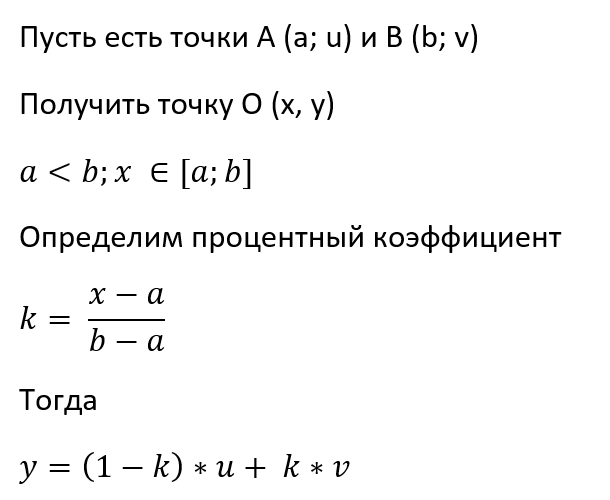

## Скейлинг данных

В ходе разработки сети LSTM появилась нужна в разработке Scaler для данных, который бы переводил числа из диапазона [a, b] в эквивалентное число в диапазоне [c, d]. Разработанный класс Scaler позволяет настраивать эти диапазоны и скейлить как отдельные числа, так и целые цепочки. В нашей задачи Scaler переводит данные по оси У (значения датчиков), которые располагаются преимущественно в диапазоне от [0, 100], но даже если и есть превышение, можно при создании экземпляра в параметры дать цепочку данных, и класс определит рабочий диапазон, в эквивалентную цепочку от [0, 1], поскольку результат прогнозирования выдаётся в этом диапазоне. Описание класса находится в файле Scaler.h и Scaler.cpp.

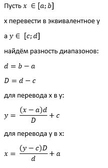  

# Результаты работы программы 

Красная линия - обучающая выборка, синяя линия - реальные данные, зелёная линия - предсказания сети. Результаты по data 1 cid 6:

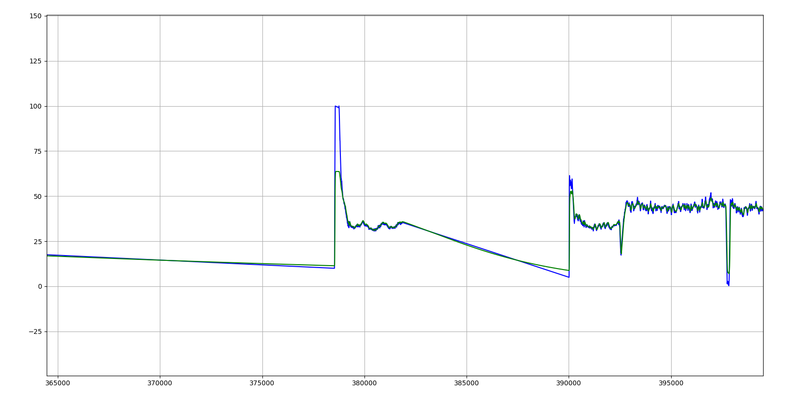  

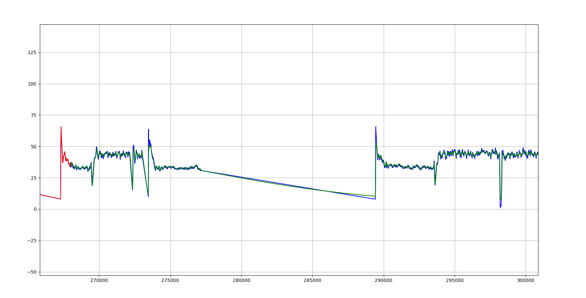  

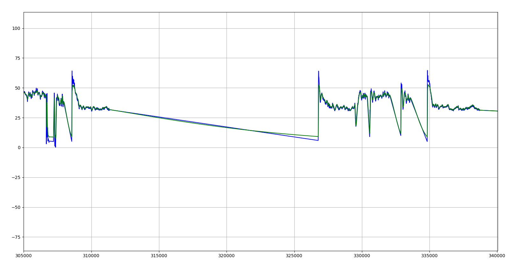  
