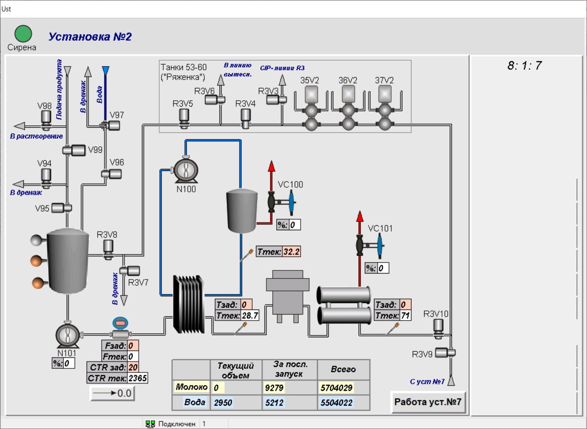

# Данные работы ПОУ

## Общее описание ПОУ

Общий вид пастеризационной установки приведен на рисунке ниже.

## Исходные параметры

Исходные данные (*.csv) имеют следующий формат: первый столбец - идентификатор датчика или исполнительного устройства (**cid**), второй - дискретное время, третий - значение. Описание приведено в таблице ниже:

| **cid**    | Описание             | Размерность  |
| -------|----------------------| -----:|
|1| **N101** (мощность), циркуляционный насос | 0-100 (0 - минимальная мощность, 100 - максимальная мощность) |
|2| **FE101**, расход | м3/час |
|3| **TE100**, температура гомогенизации | °C |
|4| **VC100** (степень открытия), паровой клапан | 0-100 (0 - полностью закрыт, 100 - полностью открыт) |
|5| **TE101**, температура пастеризации| °C |
|6| **VC101** (степень открытия), паровой клапан | 0-100 (0 - полностью закрыт, 100 - полностью открыт) |

