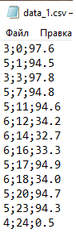

***<h1 align = "center">Парсинг данных</a>***

## **Цель:**

Проанализировать данные, лежащие в csv-файлах и подготовить их к визуализации.

## **Анализ данных:**

 
Данные, хранящиеся в csv-файлах, представляют собой таблицу. В первом столбце указан cid датчика. Во втором столбе указывается дискретный момент времени. В третий столбик записывается уже некоторая информация, относящаяся к конкретному cid, например, степень открытия или температура в градусах Цельсия и т.д. По этой причине, чтобы не мешать в одном графике все cid, был выполнен парсинг данных, чтобы в дальнейшем можно было работать с данными конкретного cid. Пример содержимого исходных файлов (data_1.csv):  

  

  

## **Код программы:**  

Код программы представлен в папке src, а результаты работы в папке data.

Код предназначается для единичного использования!

Данные же после парсинга имеет вид:

## **Вывод:**  

Проанализировал данные, лежащие в csv-файлах и подготовил их к визуализации, путём парсинга данных по их cid. В дальнейшем будут использоваться данные из файлов, полученные при парсинге. Хранить каждый набор данныех для каждого файла на GitHub не рационально, поэтому их там не будет.   

