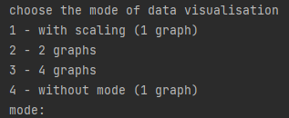
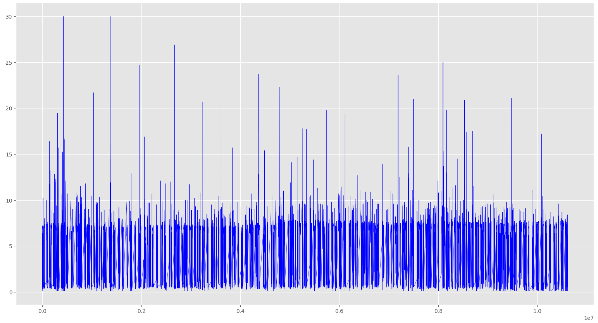
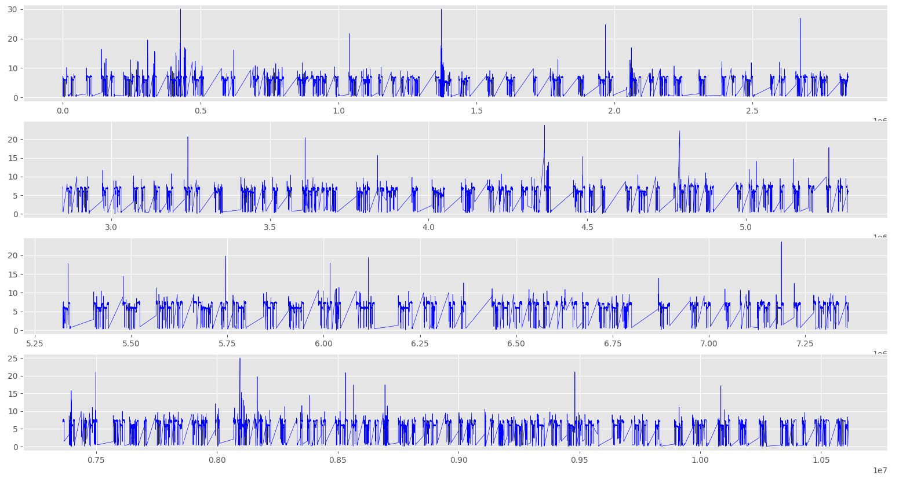
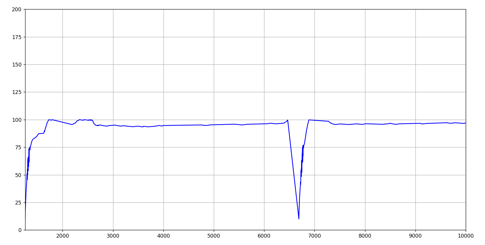
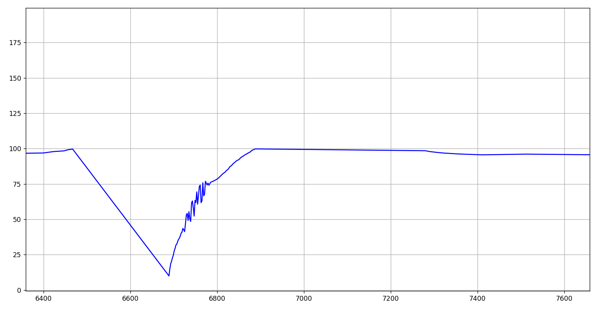

***<h1 align = "center">Визуализация данных из csv-файлов</a>***

## **Цель работы:**

Визуализировать данные, находящиеся в файлах data_<i>.csv, где i = 1..7. Однако после парсинга данных, мы можем визуализировать данные для конкретного cid отдельно. Код программы находится в папке crs.

## **Визуализация данных:**

### **Режимы визуализации:**

Представлено 4 режима визуализации данных. Начнём с последнего, т.к. он самый простой и представляет собой построение одного графика для данных. Этот способ не подходит для большого количества данных, потому что на нём ничего не будет видно. Но конечно же, если данных не много, то режим подойдёт. Если же данных всё же слишком много для одного графика, то целесообразно использовать разбиение данных на части. Представлены возможность разбиения данных на два графика и разбиения данных на 4 графика. Для использования этих методов также рекомендуется произвести обработку данных. Также есть можно использовать один график с возможностью масштабирования оси X. Подойдёт для детального исследования исходных данных на конкретный промежутках. Покажем пример каждой из визуализации на примере файла data_1_cid_2.csv.

  

## **Демонстрация визуализации данных:**

меню визуализации  
  

без масштабирования  
  

два графика  
  

четыре графика  
  
  
график с маштабирование будет представлн ниже.  
выбор: график с возможностью масштабирования оси X  
  

уменьшение диапазона по оси X  
  

увеличение диспазона по оси X  
  

## **Вывод:**

На основании данных визуализации в дальнейшем необходимо проверить данные на наличии аномалии, а также спрогнизировать дальнейшее поведение графика. Также сделать инфографику для результатов визуализации. 

  
